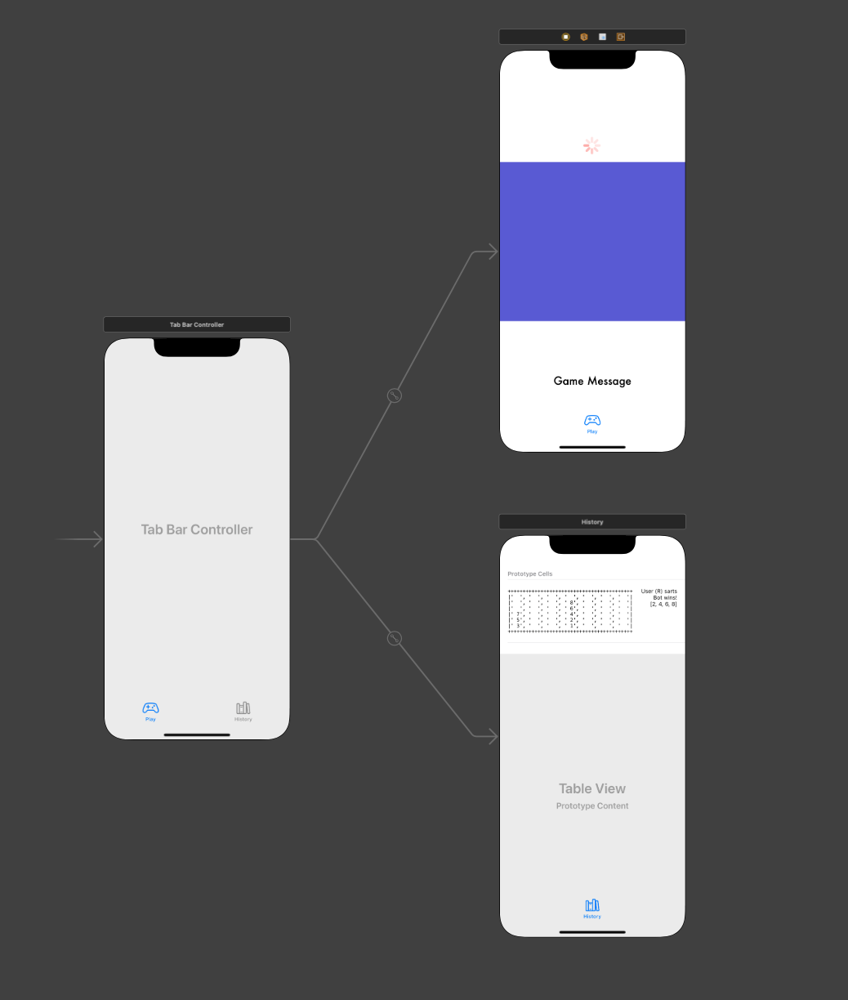

# Connect4

## Video Demo

https://youtube.com/shorts/sQTLHSz76c8?feature=share

## Storyboard

The application consists of 3 scenes: `Tab Bar Controller`, `Play` and `History`, 
as seen below. The constraints are set so that the views look as they appear in 
the storyboard, and in different device orientations the game can be played. The 
`Play` scene is where the game is accessed. It consists of 2 stacked UIViews, 
which are used for the front and back of the Connect4 board. The front view is a 
`UIView` subclass, `BoardView`, which includes the code for drawing out the gaps 
in the board to see which disc is in which slot. This was done by dividing the 
board into a 7x6 grid of cells, and drawing a circle in each cell that had a 
diameter of 86% the size of the smaller dimension (width or height). The view 
behind is a `UIView` called `gameView`, which sets the boundaries for the game 
and adds discs as it's subviews.

The `History` scene shows previous results from games, and is uneditted from the 
source code supplied.

## ViewController

The `ViewController` is where all game logic is stored. There are two key 
functions defined: `botDropsDisc` and `dropDisc`. The former is called in 
`didDropDisc` in the `GameSessionProtocol`, in the case of a bot making a move, 
to show a disc dropped by the bot. It takes in a location tuple which contains 
the row and column the disc needs to be dropped in. A disc is created, coloured 
correctly, and dropped into that column, using the column width to determine 
where on the screen for it to be dropped. `dropDisc` is called when a user 
touches the screen if it is their turn. It is called by a `tap` function which 
provides the coordinates of where the user has tapped, and the disc is then 
created as a `DiscView` with the correct colour and location.

When `viewDidLoad` is called, a new game session is created. The board width and 
height are recorded, which are then used to determine the correct size of each 
row, column and disc. A `UIDynamicAnimator` is created then that adds elastic, 
gravitational and collision behaviours. The boundaries at the bottom and between 
columns on the board are created, and a `UISwipeGestureRecognizer` is created, 
which calls a function to clear the board and restart the game when the user 
swipes down.

The `gameMessage` is a `UILabel` that updates as the game state changes to alert 
the user when it is their turn, and of the final result of the game.

When the game ends, the order of moves will appear on the discs. The game will 
wait for 3 seconds before clearing the board, followed by another second before 
it restarts a new game.

## Further Work

In order to improve the game, I would include the coordinates of each disc as 
attributes in the `DiscView` and pass them in as the disc is dropped. Then I 
would have been able to include persistence in the application, as I would need 
these coordinates to make the discs appear in their correct positions. It would 
also allow me to highlight the disc numbers that won the game, as the GameSession 
provides the coordinates of the winning discs, so if I had more time to work on 
this assignment, implementing disc coordinates would be the next step.

I would also have been able to prevent placing a disc at the top of a full column 
if I had these attributes implemented, as there is still a bug in the game that 
allows the user to place a disc on top of a full column, which won't be 
recognised by the game. This would have been done by checking if the row number 
was less than 7 before placing the disc.

I would then have implemented a button to allow the user to decide who goes 
first. This would have changed the `isBotFirst` variable in `newGameSession`, and 
set it accordingly.

